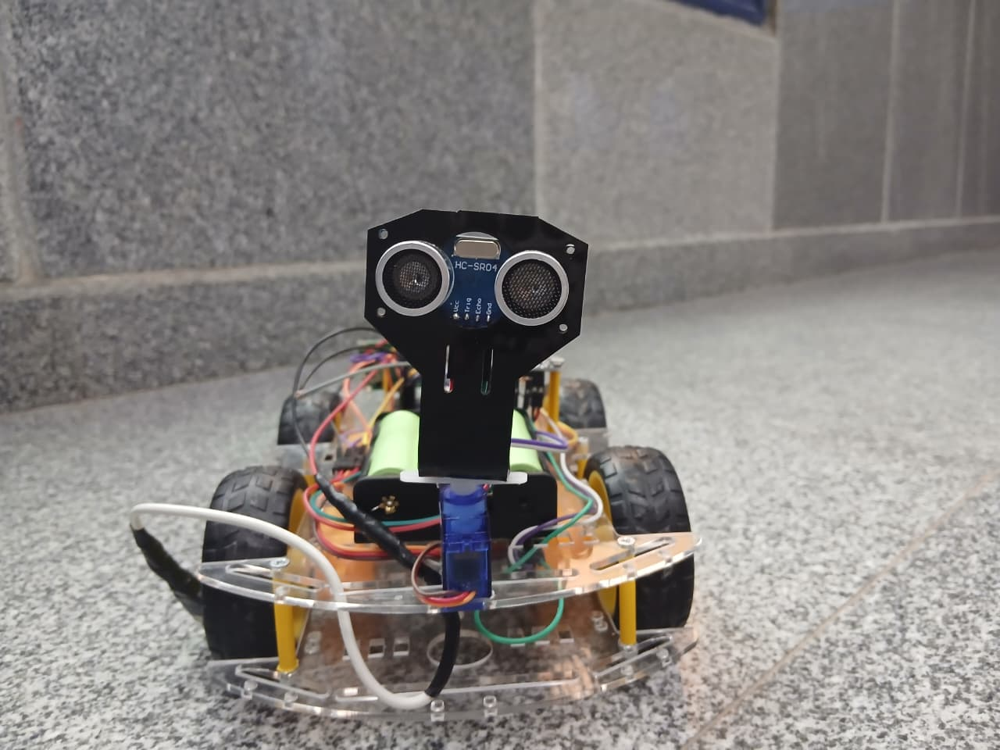
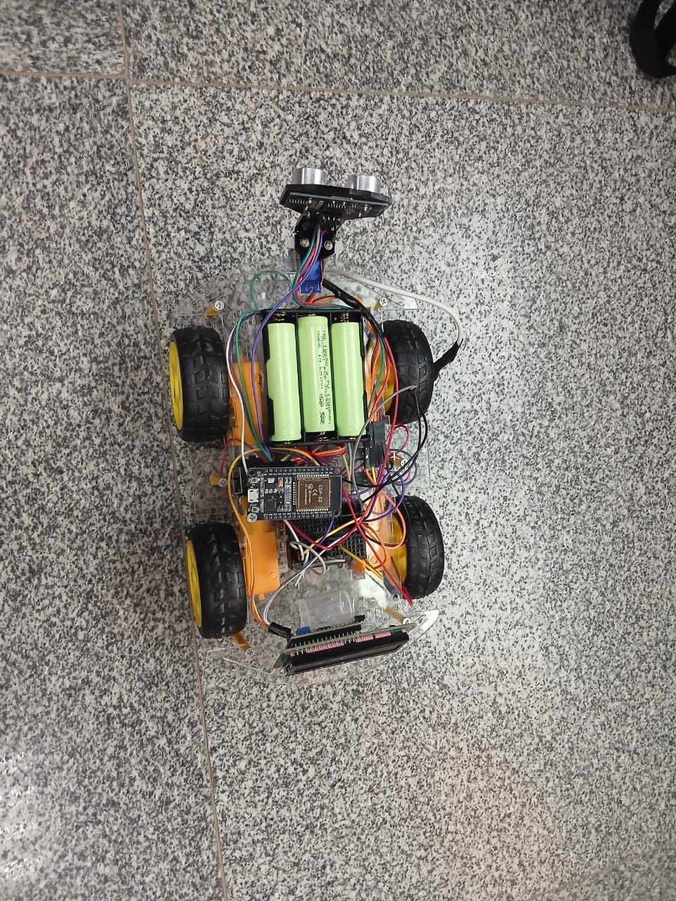
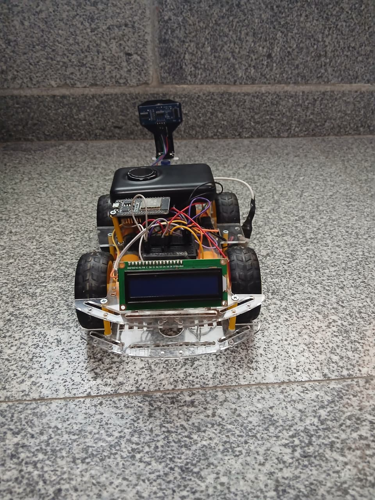

# ESP32-Autonomous-Mobile-Robot
# ESP32 Dual-Mode Mobile Robot with Autonomous Obstacle Avoidance & Teleoperation 🤖🚗

A modular, 4-wheel mobile robot powered by an **ESP32 DevKit V1** microcontroller. The system features dual operating modes: real-time **Bluetooth teleoperation** and **autonomous obstacle avoidance** driven by ultrasonic servo-scanning and optical speed encoders.
## 📸 Physical Hardware Prototype

  
  
  

---

## 📸 System Architecture & Block Diagram
The system integrates power distribution, sensing, actuation, and visual telemetry:

- **Brain:** ESP32 DevKit V1 (Wi-Fi/Bluetooth enabled)
- **Motor Control:** L298N Dual H-Bridge Motor Driver
- **Obstacle Sensing:** HC-SR04 Ultrasonic Sensor mounted on an SG90 Servo Motor (180° scanning)
- **Speed & Distance Tracking:** Optical Speed Encoder utilizing Hardware Interrupts (ISR)
- **Telemetry Display:** 16x2 I2C LCD
- 

## 🔌 Detailed Hardware Architecture & Pinout Description

here is a detailed breakdown of the power distribution and signal routing across all subsystems:

### 1. Power Distribution Network
- **Primary Power Source:** 12V High-Cap Battery Pack[cite: 2].
- **High-Power Rail (12V):** Powers the L298N Motor Driver and I2C LCD Display directly[cite: 2].
- **Logic Power Rail (5V):** Regulated via a 5V Buck Converter / LM7805 Linear Regulator to power the ESP32 Microcontroller logic and low-power sensors (Ultrasonic & Servo)[cite: 2].

---

### 2. Microcontroller Pinout & Peripheral Connections (ESP32 DevKit V1)

#### 🏎️ Motor Control (L298N H-Bridge Driver)
- **PWM Speed Channels:** `ENA -> GPIO 32` | `ENB -> GPIO 33` (Driven via ESP32 `ledc` PWM timers at 5kHz)[cite: 2].
- **Direction Pins (Left Motor):** `IN1 -> GPIO 25` | `IN2 -> GPIO 26`[cite: 2].
- **Direction Pins (Right Motor):** `IN3 -> GPIO 27` | `IN4 -> GPIO 14`[cite: 2].

#### 🦇 Obstacle Avoidance Subsystem (HC-SR04 & SG90 Servo)
- **Ultrasonic Trigger:** `Trig -> GPIO 5` (Sends 10µs ultrasonic burst pulses)[cite: 2].
- **Ultrasonic Echo:** `Echo -> GPIO 18` (Reads return signal pulse duration)[cite: 2].
- **Servo Motor Signal:** `PWM -> GPIO 23` (Rotates ultrasonic sensor 180° for directional scanning)[cite: 2].

#### ⏱️ Speed & Position Telemetry (Optical Encoder)
- **Encoder Pulse Output:** `Signal -> GPIO 13` (Configured with internal pull-up and bound to a hardware Interrupt Service Routine (ISR) `countPulse`)[cite: 2].

#### 📺 Visual Telemetry Display (16x2 I2C LCD)
- **I2C Serial Data:** `SDA -> GPIO 21` (Default ESP32 I2C Data line)[cite: 2].
- **I2C Serial Clock:** `SCL -> GPIO 22` (Default ESP32 I2C Clock line)[cite: 2].

---

### 📡 Wireless Communication Protocol
- **Bluetooth Classic:** Uses built-in ESP32 Bluetooth stack configured via `BluetoothSerial.h` to process incoming ASCII control characters (`F`, `B`, `L`, `R`, `S`) from a connected smartphone application[cite: 2].
---

## 🎯 Key Features & Operating Modes

### 1. Manual Control Mode (Bluetooth Teleoperation)
Receives real-time motion commands (`Forward`, `Backward`, `Left`, `Right`, `Stop`) over Bluetooth Classic and executes them immediately.

### 2. Autonomous Obstacle Avoidance Mode (Active Safety)
Monitors distance continuously using the HC-SR04 sensor. When an obstacle is detected within **25 cm**:
1. The robot halts immediately.
2. The SG90 servo motor rotates the ultrasonic sensor to scan both **Right** (5°) and **Left** (175°).
3. The robot compares available distances and automatically steers toward the clearest path.

### 3. Non-Blocking Speed & Distance Tracking
Uses an Optical Encoder connected to an **Interrupt Service Routine (ISR)** to count pulse signals in real time without causing software delays in the main loop execution.

---

## 🛠️ Hardware Component List

| Component | Function / Role |
| :--- | :--- |
| **ESP32 DevKit V1** | Core Microcontroller (Processes Bluetooth & Sensor Logic) |
| **L298N Motor Driver** | Controls direction and PWM speed for 4 DC Motors |
| **HC-SR04 Ultrasonic** | Measures distance to frontal obstacles |
| **SG90 Servo Motor** | Rotates the Ultrasonic sensor for multi-directional scanning |
| **I2C LCD 16x2** | Displays real-time obstacle distance and encoder data |
| **Optical Speed Encoder** | Measures wheel rotations to compute traveled distance |
| **LM7805 / Buck Converter**| Regulates 12V Battery power supply to 5V logic power |

---

## 💻 Software & Libraries Used
- `BluetoothSerial.h` - Handles Classic Bluetooth communication
- `Wire.h` - Manages I2C protocol for the LCD display
- `LiquidCrystal_I2C.h` - Controls the 16x2 I2C LCD screen
- `ESP32Servo.h` - Controls SG90 servo rotation angles

---

## 👥 Project Team & Acknowledgments
- **Submitted By:** Toqa Haitham, Malak Sayed, Radwa Khaled, Anas Hesham, Ahmad Osama
- **Supervised By:** Prof. Dr. Taha Helmy, Eng. Hussein Rashed, Eng. Kareem Ameed, Eng. Sara Abdel-Naser
- **Institution:** Modern University for Technology and Information (MTI) - Mechatronics Department
